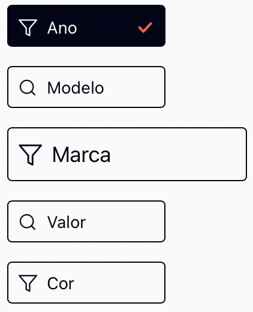

# RadioButton



Componente para ser utilizado como um radiobutton, RadioButton necessita receber um array contendo informações para montagem de seus botões.

### RadioButton possui dois parâmetros

- items: um array do tipo RadioProps;
- getResult: função que receberá informação sobre qual dos botões foi selecionado. A função recebe o array RadioProps com todos os items, apresentando um deles contendo o campo isChecked como true.

### O tipo de dados RadioProps define os seguintes campos

- isChecked: boolean, para informar se o item está selecionado;
- size: smal, medium ou large, para o tamanho da renderização do item;
- tag: string que contem a informação associada ao item e que é retornada para informar de sua seleção;
- label: string que será apresentada na tela como representação textual do item;
- icon: string, nome da imagem svg que está armazenada e referenciada em public/img/icons/icons.svg.

### Exemplo de Array RadioProps

```typescript
const radioButtonMock: RadioProps[] = [
  {
    tag: '1',
    label: 'Ano',
    icon: '/img/icons/Icons.svg#Filter'
  },
  {
    tag: '2',
    label: 'Modelo',
    icon: '/img/icons/Icons.svg#Search',
    size: 'medium'
  },
  {
    tag: '3',
    label: 'Marca',
    icon: '/img/icons/Icons.svg#Filter',
    size: 'large'
  },
  {
    tag: '4',
    label: 'Valor',
    icon: '/img/icons/Icons.svg#Search'
  },
  {
    tag: '5',
    label: 'Cor',
    icon: '/img/icons/Icons.svg#Filter'
  }
]

```

O array acima pode ser visto rederizado no storybook do projeto.

### Trabalhando as imagens SVG em um arquivo de sprite

É possível organizar todos os ícones a serem utilizados com o componente ou até mesmo em todo o projeto criando um arquivo de sprite. Ele permite todas as vantagens que ter o SVG inline permite, mas de forma organizada e sem repetições pela utlização da diretiva *symbol* em conjunto com a diretiva *use*.

### Exemplo do arquivo de Sprite

/img/icons/icons.svg:

```html
<svg version="1"  xmlns="http://www.w3.org/2000/svg" width="14" height="13" >
  <symbol id="Filter" viewBox="0 0 14 13">
    <path
      d="M13.5 1H1L6 6.9125V11L8.5 12.25V6.9125L13.5 1Z"
      stroke-linecap="round"
      stroke-linejoin="round"/>
  </symbol>
  <symbol id="Search" viewBox="0 0 15 15">
    <path
      d="M6.875 11.875C9.63642 11.875 11.875 9.63642 11.875 6.875C11.875 4.11358 9.63642 1.875 6.875 1.875C4.11358 1.875 1.875 4.11358 1.875 6.875C1.875 9.63642 4.11358 11.875 6.875 11.875Z"
      stroke-linecap="round"
      stroke-linejoin="round"/>
    <path
      d="M13.125 13.125L10.4062 10.4062"
      stroke-linecap="round"
      stroke-linejoin="round"/>
  </symbol>
</svg>

```
